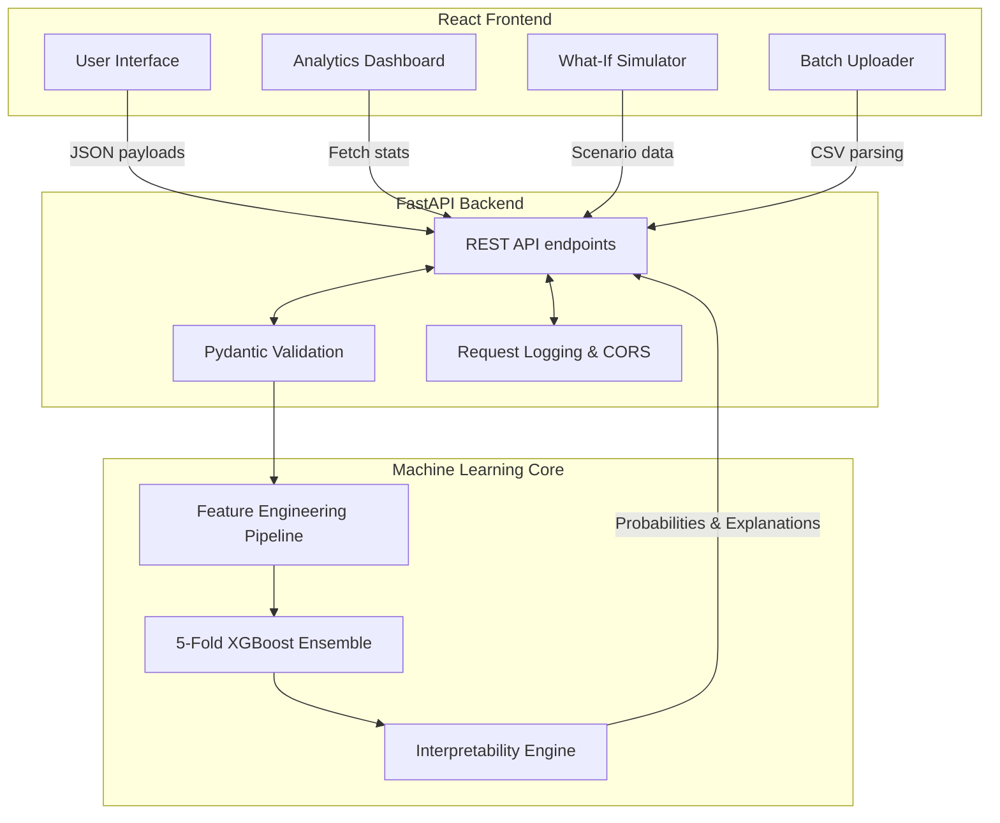

# ChurnGuard: Customer Churn Prediction Project

<div align="center">
  
  <a href="https://churnguard-ten.vercel.app"></a>
  <a href="https://churnguard-api.onrender.com/docs"></a>
  <br />
  
  
  
  
  
</div>

<br />

ChurnGuard is a full-stack machine learning project built to predict telecommunications customer churn. The project explores model interpretability and serving predictions via a REST API.

The model achieves an OOF ROC-AUC of 0.916 on the Kaggle Playground Series S6E3 dataset, and the application provides actionable risk assessments with SHAP-based feature attributions.

---

## Key Features

- **Real-Time Inference**: FastAPI backend for single-instance predictions.
- **Batch Processing**: Scoring capabilities for multiple customers per request.
- **Interactive Simulator**: Tool to simulate risk changes by tweaking customer features.
- **Explainable AI**: Integrated SHAP values for predictions, showing feature-level risk attribution.
- **Analytics Dashboard**: Metrics and risk distributions visualized with React and Recharts.
- **MLOps Features**: 5-Fold Stratified Ensembling, Pydantic schema validation, and test coverage.

---

## System Architecture



---

## Machine Learning Pipeline

### Data & Engineering
- **Dataset**: Built on the [Kaggle Playground Series S6E3](https://www.kaggle.com/competitions/playground-series-s6e3) dataset.
- **Feature Engineering**: Extracted predictive features including:
  - `risk_score`: Aggregation of categorical risk factors (contract type, auto-pay status, fiber optic usage).
  - `charge_contract_risk`: Interaction term between financial commitment and contract length.
  - `ChargeDiff`: Discrepancy metric between `TotalCharges` and expected charges.

### Modeling Strategy
The prediction model is a Stratified 5-Fold Ensembled XGBoost Classifier.
- **Imbalance Handling**: Uses `scale_pos_weight` to handle the minority class.
- **Variance Reduction**: Independent training of folds for out-of-fold generalization.
- **Hyperparameter Tuning**: Tuned with early stopping, `max_depth=6`, and stochastic sampling.

### Evaluation Metrics
| Metric | Score |
|---|---|
| **ROC-AUC (OOF)** | **0.916** |
| Precision | 0.513 |
| Recall | 0.923 |
| F1 Score | 0.660 |
| Accuracy | 0.786 |

---

## Explainability & Interpretability

ChurnGuard incorporates global and local interpretability methods.

- **Global Feature Importance**: Shows trends in customer behavior across the dataset.
- **Local SHAP Explanations**: The `/predict` endpoint returns feature attributions, quantifying how much variables like `tenure` or `MonthlyCharges` contributed to a user's risk score.


---

## API Reference

The backend exposes a REST API via FastAPI. OpenAPI documentation is available at `/docs` when running the server.

### Core Endpoints

- `POST /predict`: Single instance scoring with SHAP values.
- `POST /whatif`: Comparative analysis between base and mutated customer states.
- `POST /batch`: Scoring for multiple records.
- `GET /dashboard`: Aggregated model statistics and distributions.
- `GET /health`: Readiness and liveness probe.

**Example `POST /predict` Response:**
```json
{
  "churn_probability": 0.7823,
  "churn_prediction": true,
  "risk_tier": "High",
  "shap_values": [
    {
      "feature": "contract_risk",
      "value": 2.0,
      "shap_val": 0.342,
      "direction": "increases_churn"
    }
  ],
  "confidence": 0.941,
  "latency_ms": 18.4
}
```

---

## Local Development

### Prerequisites
- Docker & Docker Compose
- Python 3.10+
- Node.js 18+

### Quickstart (Docker)
Launch the entire stack using docker-compose:
```bash
docker-compose up --build
```
- API: `http://localhost:8000`
- Frontend: `http://localhost:5173`

### Manual Setup

**Backend:**
```bash
cd backend
python -m venv venv
source venv/bin/activate
pip install -r requirements.txt
uvicorn main:app --reload --port 8000
```

**Frontend:**
```bash
cd frontend
npm install
echo "VITE_API_URL=http://localhost:8000" > .env.local
npm run dev
```

---

## Testing

Automated tests cover input validation and feature accuracy.

```bash
cd backend
pip install pytest httpx
pytest tests/ -v
```

---

## Future Improvements
- [ ] Implement true SHAP TreeExplainer instead of proxy feature importance.
- [ ] Add data drift monitoring to track changes in feature distributions.
- [ ] Integrate a model registry for tracking experiments.

---

