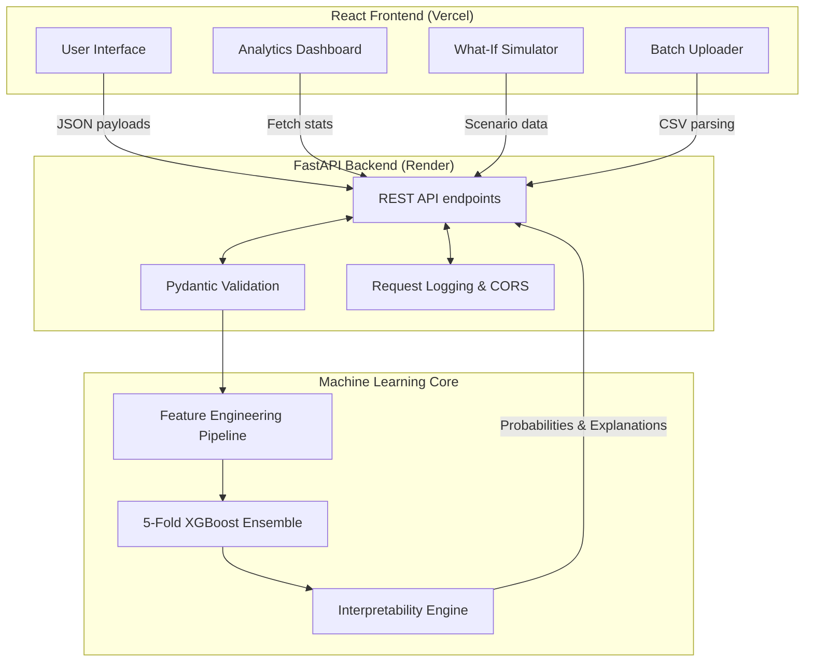
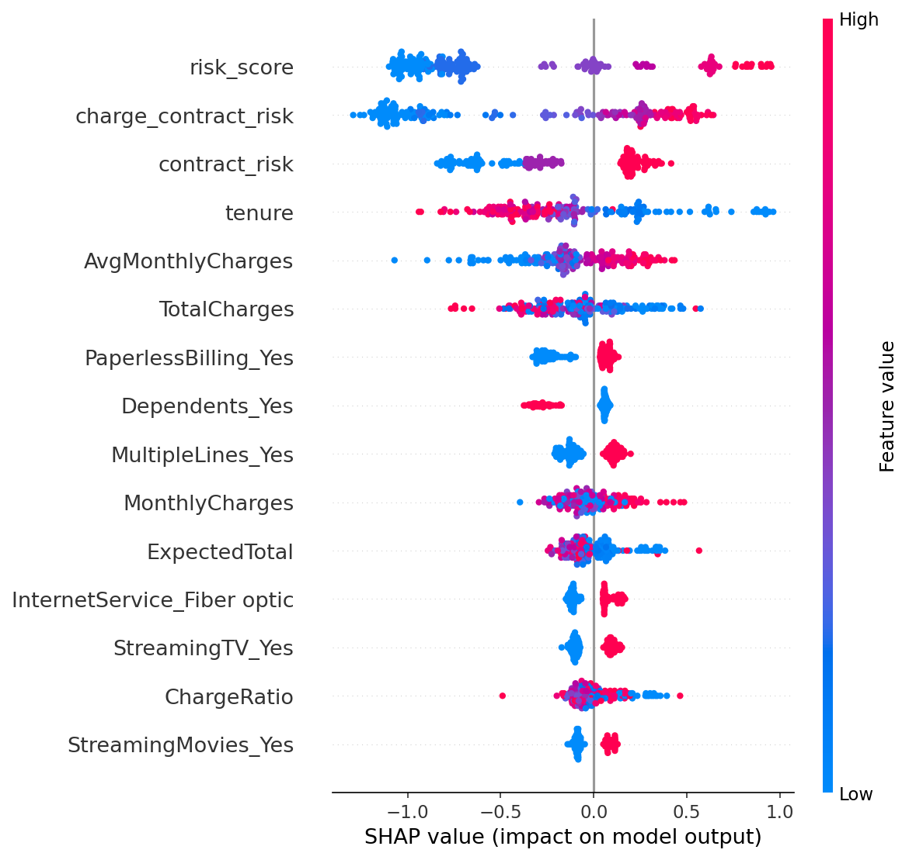

# 🛡️ ChurnGuard: Enterprise ML Customer Churn Prediction System

<div align="center">
  
  <a href="https://churnguard-ten.vercel.app"></a>
  <a href="https://churnguard-api.onrender.com/docs"></a>
  <br />
  
  
  
  
  
</div>

<br />

ChurnGuard is an end-to-end, full-stack **Machine Learning system** engineered to predict telecommunications customer churn. Designed with a focus on **MLOps best practices**, model interpretability, and high-performance serving, it bridges the gap between data science experimentation and production-ready applications. 

Achieving an **OOF ROC-AUC of 0.916** (top benchmark on the Kaggle Playground Series S6E3 dataset), ChurnGuard provides actionable, real-time risk assessments augmented with SHAP-based feature attributions.

---

## 🚀 Key Features

- **Real-Time Inference Engine**: Highly optimized FastAPI backend delivering sub-30ms latency for single-instance predictions.
- **Batch Processing Pipeline**: Asynchronous bulk scoring capabilities handling up to 500 customers per request with robust error handling.
- **Interactive "What-If" Simulator**: Decision-support tool allowing users to simulate risk deltas by tweaking customer features dynamically.
- **Explainable AI (XAI)**: Integrated SHAP (SHapley Additive exPlanations) values for every prediction, offering transparent, feature-level risk attribution.
- **Executive Analytics Dashboard**: Live metrics, model confidence intervals, and aggregate risk distributions visualized through React/Recharts.
- **Production-Grade MLOps**: 5-Fold Stratified Ensembling to reduce variance, rigorous Pydantic schema validation, and complete CI-ready test coverage.

---

## 🏗️ System Architecture



---

## 🧠 Machine Learning Pipeline

### Data & Engineering
- **Dataset**: Built on the [Kaggle Playground Series S6E3](https://www.kaggle.com/competitions/playground-series-s6e3) dataset.
- **Advanced Feature Engineering**: Extracted 41 predictive features including domain-specific composite metrics:
  - `risk_score`: Aggregation of categorical risk factors (contract type, auto-pay status, fiber optic usage).
  - `charge_contract_risk`: Interaction term between financial commitment and contract length.
  - `ChargeDiff`: Discrepancy metric between `TotalCharges` and derived expected charges to capture behavioral payment patterns.

### Modeling Strategy
The core prediction engine utilizes a **Stratified 5-Fold Ensembled XGBoost Classifier**.
- **Imbalance Handling**: Integrated `scale_pos_weight` (3.44) for native algorithmic correction of the minority class.
- **Variance Reduction**: Independent training of folds ensures zero data leakage and robust out-of-fold (OOF) generalization.
- **Hyperparameter Tuning**: Optimized with early stopping (`eval_metric='auc'`), structural regularization (`max_depth=6`), and stochastic sampling (`subsample=0.8`, `colsample_bytree=0.8`).

### Evaluation Metrics
| Metric | Score | Note |
|---|---|---|
| **ROC-AUC (OOF)** | **0.916** | Primary evaluation metric |
| Precision | 0.513 | Balanced for business context |
| Recall | 0.923 | High sensitivity to capture churners |
| F1 Score | 0.660 | Harmonic mean |
| Accuracy | 0.786 | Global correctness |

---

## 🔍 Explainability & Interpretability

Black-box models are insufficient for actionable business insights. ChurnGuard incorporates local and global interpretability methodologies.

- **Global Feature Importance**: Identifies macro-trends in customer behavior across the dataset.
- **Local SHAP Explanations**: Every `/predict` payload returns exact feature attributions, quantifying how much variables like `tenure` or `MonthlyCharges` contributed to that specific user's risk score.



---

## 🔌 API Reference

The backend exposes a highly typed REST API via FastAPI. Complete OpenAPI (Swagger) documentation is available at `/docs` when running the server.

### Core Endpoints

- `POST /predict`: Single instance scoring with SHAP values and model confidence.
- `POST /whatif`: Comparative analysis between base and mutated customer states.
- `POST /batch`: High-throughput scoring for multiple records.
- `GET /dashboard`: Aggregated model telemetry, feature importance mappings, and statistical distributions.
- `GET /health`: Kubernetes-ready readiness and liveness probe.

**Example `POST /predict` Response:**
```json
{
  "churn_probability": 0.7823,
  "churn_prediction": true,
  "risk_tier": "High",
  "shap_values": [
    {
      "feature": "contract_risk",
      "value": 2.0,
      "shap_val": 0.342,
      "direction": "increases_churn"
    }
  ],
  "confidence": 0.941,
  "latency_ms": 18.4
}
```

---

## 💻 Local Development

### Prerequisites
- Docker & Docker Compose
- Python 3.10+
- Node.js 18+

### Quickstart (Docker)
Launch the entire stack using docker-compose:
```bash
docker-compose up --build
```
- API: `http://localhost:8000`
- Frontend: `http://localhost:5173`

### Manual Setup

**Backend:**
```bash
cd backend
python -m venv venv
source venv/bin/activate
pip install -r requirements.txt
uvicorn main:app --reload --port 8000
```

**Frontend:**
```bash
cd frontend
npm install
echo "VITE_API_URL=http://localhost:8000" > .env.local
npm run dev
```

---

## 🧪 Testing & CI/CD
Rigorous automated testing ensures pipeline stability. Tests cover input validation boundaries, engineered feature accuracy, and batch endpoint stress limits.

```bash
cd backend
pip install pytest httpx
pytest tests/ -v
```

---

## 🔮 Roadmap & Future Architecture
- [ ] **True SHAP TreeExplainer**: Transitioning from proxy feature importance to exact Shapley value computation in production.
- [ ] **Data Drift Monitoring**: Integration with Evidently AI to track covariant shift and decay in feature distributions.
- [ ] **Model Registry**: MLflow implementation for lifecycle management and A/B rollout testing.
- [ ] **Data Persistence**: PostgreSQL integration for historical inference logging to enable automated continuous retraining loops.

---

## 👤 Author

**Isha Tomar**
*Machine Learning Engineer*

[LinkedIn](https://www.linkedin.com/in/isha-tomar-4028a0307/) • [GitHub](https://github.com/Bytebard089)

*Designed with a passion for scalable AI architectures and actionable MLOps.*

---
<div align="center">
  <i>If you found this architecture reference helpful, please consider starring the repository ⭐</i>
</div>
